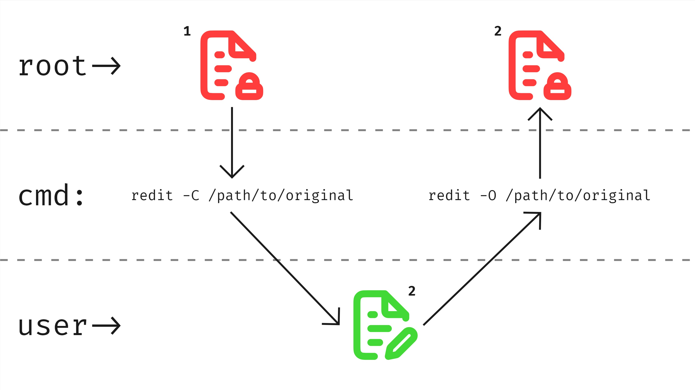

# redit

`redit` (root + edit) is a command-line tool for Linux, designed to simplify the process of copying, editing, and overwriting files from other users. As the name suggests, it combines root privileges and editing capabilities into a single, easy-to-use command.




## About This Project

- I am new to developing programs for the Linux terminal and also to managing repositories in a semi-professional manner.
- This project is a **personal endeavor**, tailored to my own needs and preferences. As such, I cannot guarantee it will be comfortable or useful for everyone, but I hope it will be a good starting point for others with similar needs.

## Features

- Copy files with root privileges and retain original ownership and permissions.
- Overwrite files while preserving original metadata.
- Choose your preferred editor for editing copied files.

## Usage

```sh
redit -C /path/to/original/file
redit -O /path/to/edited/file
